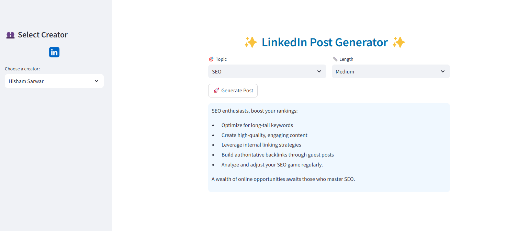

# ✨ LinkedIn Post Generator

This project is a **LinkedIn Post Generator** application that uses an LLM to generate posts based on a selected LinkedIn creator’s style, specific topic, and post length. This app is built using **Streamlit** and allows users to generate LinkedIn posts that align with the style of popular content creators.

*Here is a screenshot of the LinkedIn Post Generator app.*




## 🚀 Features
- Generate posts according to **Topic (Tags)** and **Length** selected by the user.
- Choose from multiple LinkedIn content creators (Irfan Malik, Hisham Sarwar, Usman Asif) with each creator's unique post style.
- Intuitive interface and LinkedIn-style icon integration.
- Leverages LLMs for generating post content.

## 🔧 Installation

1. **Clone the repository**:
    ```bash
    git clone https://github.com/Zeeshier/GenAI-Posts-Generator.git
    cd GenAI-Posts-Generator
    ```

2. **Install dependencies**:
    ```bash
    pip install -r requirements.txt
    ```

3. **Create a `.env` file**:
    To use the LLM for post generation, you'll need to add a **Groq Cloud API Key** to the `.env` file:
    ```plaintext
    GROQ_CLOUD_API_KEY=your_api_key_here
    ```

4. **Run the application**:
    ```bash
    streamlit run app.py
    ```

## 🛠️ Usage

1. **Select Creator**: Choose a LinkedIn creator to generate posts in their style.
2. **Select Topic and Length**: Choose the desired topic and length for the post.
3. **Generate**: Click on the **Generate Post** button to view the generated content.

## 📂 Project Structure

- **app.py**: Main Streamlit application file.
- **fewshot.py**: Handles loading and filtering posts based on selected tags and length.
- **postgenerate.py**: Module for generating post content based on input.
- **Data/**: Folder containing processed JSON files for each creator.

